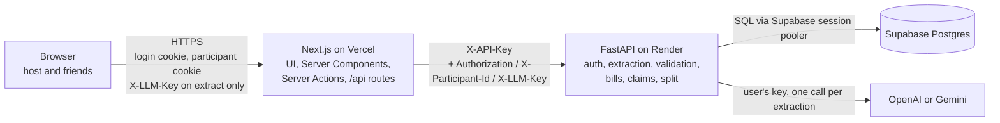

# Split the Bill — Backend

FastAPI service behind **Split the Bill**: a host photographs (or pastes) a restaurant receipt, an LLM of their choice reads it, the numbers are validated to the paisa, and friends open a share link to claim what they had. Everyone sees exactly what they owe — tax, service charge, discounts and tip split in proportion to what they ate — and the totals always add up to the bill.

| | |
|---|---|
| Live app | <https://split-the-bill-platform.vercel.app> |
| Live API | <https://split-the-bill-api.onrender.com> — interactive docs at [`/docs`](https://split-the-bill-api.onrender.com/docs) |
| Frontend repo | [RPSingh0/split-the-bill-platform](https://github.com/RPSingh0/split-the-bill-platform) (Next.js on Vercel) |
| AI usage notes | [AI_USAGE.md](AI_USAGE.md) |

---

## Contents

1. [Architecture](#architecture)
2. [Tech stack](#tech-stack)
3. [Running locally](#running-locally)
4. [Environment variables](#environment-variables)
5. [Deploying to Render](#deploying-to-render)
6. [API reference](#api-reference)
7. [How it works](#how-it-works)
8. [API key handling](#api-key-handling)
9. [Trust model and assumptions](#trust-model-and-assumptions)
10. [Decisions we made](#decisions-we-made)
11. [Known limitations and next steps](#known-limitations-and-next-steps)
12. [Project layout](#project-layout)

---

## Architecture



| Part | Role |
|---|---|
| **Next.js (Vercel)** | The only thing the browser talks to. Calls this API from server-side code only, adding the shared `X-API-Key`. |
| **FastAPI (Render)** — this repo | The only database client and the only thing that calls an LLM. Owns accounts, extraction, validation, bills, claims and the split. |
| **Supabase Postgres** | Stores users, bills, items, charges, participants and claims. The split is never stored — it is computed on every read. |
| **OpenAI / Gemini** | Called once per extraction with the **user's own key**, sent per request. No LLM key exists in any environment. |

Boundary rules:
- Every endpoint except `GET /health`, `/docs` and `/openapi.json` requires `X-API-Key` (compared in constant time). A missing or wrong key returns `401`.
- The browser never calls this API directly.

---

## Tech stack

| | |
|---|---|
| Language | Python 3.13, managed with **uv** (`pyproject.toml`) |
| Web | FastAPI, Pydantic v2, pydantic-settings, uvicorn |
| Database | SQLAlchemy 2.0 + psycopg 3 on Postgres (Supabase in production, Postgres 16 in Docker locally) |
| Auth | argon2id password hashing (`argon2-cffi`), HS256 JWT (`PyJWT`) |
| LLM | Official `openai` and `google-genai` SDKs |
| Tests | pytest + Hypothesis |

---

## Running locally

**One command** (Postgres + API with auto-reload):

```bash
docker compose up
```

- API: <http://localhost:8000> — interactive docs at <http://localhost:8000/docs>
- Postgres loads `schema.sql` automatically the **first** time its volume is created. To reset the database: `docker compose down -v`.
- The compose file supplies dev-only values (`FASTAPI_API_KEY=dev-only-change-me`, a dev `JWT_SECRET`, a local `DATABASE_URL`), so no `.env` file is needed. The LLM key is pasted per request, exactly as in production.

**Without Docker for the API** (still using the Docker database):

```bash
docker compose up -d db
cp .env.example .env          # then fill in FASTAPI_API_KEY and JWT_SECRET
uv sync
uv run uvicorn app.main:app --reload
```

**Tests** — no database or LLM key needed; the LLM is replaced with a fake provider:

```bash
uv run pytest
# or inside the container
docker compose run --rm backend uv run --no-sync pytest
```

---

## Environment variables

| Variable | Required | Notes |
|---|---|---|
| `FASTAPI_API_KEY` | Yes | Shared secret; the same value is set on Vercel. Never `NEXT_PUBLIC_`. |
| `DATABASE_URL` | Yes | In production, Supabase's **session pooler** string, pasted as-is. A `postgresql://…` URL is switched to the psycopg driver automatically; `postgresql+psycopg://…` works too. |
| `JWT_SECRET` | Yes | Long random string (32+ bytes) for signing host tokens. |
| `OPENAI_MODEL` | No | Defaults to `gpt-5.4-mini`. |
| `GEMINI_MODEL` | No | Defaults to `gemini-3.5-flash` (e.g. `gemini-3.5-flash-lite` for a smaller, cheaper model). |

No LLM key appears anywhere in the environment.

---

## Deploying to Render

The API runs as a Render **web service** built from the [`Dockerfile`](Dockerfile), which starts uvicorn on the `$PORT` Render provides. The Supabase project is in Tokyo (`ap-northeast-1`), so the service runs in Render's closest region, **Singapore**.

1. **Supabase** — run [`schema.sql`](schema.sql) once in the SQL editor, and copy the **session pooler** connection string (IPv4, port 5432). It can be used exactly as Supabase gives it.
2. **Render** — *New → Web Service*, connect this GitHub repo, and set:

   | Setting | Value |
   |---|---|
   | Language / Runtime | **Docker** (detected from the `Dockerfile`; no build or start command) |
   | Branch | `master` |
   | Region | Singapore |
   | Instance type | Free |
   | Health check path | `/health` |
   | Auto-deploy | Your choice — Off means deploying by hand from the dashboard |

3. **Environment variables** on Render — only `FASTAPI_API_KEY`, `JWT_SECRET` and `DATABASE_URL` (see [above](#environment-variables)). Render provides `PORT`; no LLM key is ever set.
4. **Vercel** — set `FASTAPI_URL` to the Render URL and `FASTAPI_API_KEY` to the same secret, with the functions in Singapore (`sin1`), next to the API.
5. **Smoke test** — `GET /health` returns `{"status":"ok"}`; `/docs` lists every endpoint.

The Docker runtime is used rather than Render's native Python build because dependencies are managed with uv, not a `requirements.txt`.

Render's free instances **sleep after 15 minutes without traffic**, and the first request after that takes about a minute while the service wakes up; the frontend shows a "waking up the server" message when a request runs long. The container runs uvicorn as its main process, so it shuts down cleanly when Render stops or redeploys the service.

---

## API reference

### Conventions

| Header | Used for |
|---|---|
| `X-API-Key` | Every endpoint except `/health`, `/docs`, `/openapi.json` |
| `Authorization: Bearer <jwt>` | The host (logged-in owner) |
| `X-Participant-Id: <uuid>` | A friend who joined through the link |
| `X-LLM-Provider`, `X-LLM-Key` | `/extract` only (`openai` or `gemini`, and the user's key) |

- **Money** is always integer **paise** in `*_paise` fields. There are no floats for money anywhere.
- **Errors** share one envelope: `{"error": {"code": "…", "message": "…"}}`, with extra fields where noted.
- **422 always means receipt validation failed**: `{"error": {"code": "VALIDATION_FAILED", "message": "…", "issues": [ … ]}}`. Malformed requests (wrong types, missing fields, bad UUIDs) are `400 BAD_REQUEST`, so the two never get confused.

### Endpoints

| Method and path | Who | Request | Success | Errors |
|---|---|---|---|---|
| `GET /health` | Public | — | `{"status":"ok"}` | — |
| `POST /auth/signup` | API key | `{username, password}` | `201 {user:{id,username}, token}` | 400 `BAD_REQUEST`, 409 `USERNAME_TAKEN` |
| `POST /auth/login` | API key | `{username, password}` | `200 {user, token}` | 401 `INVALID_CREDENTIALS` |
| `GET /auth/me` | Host | — | `200 {id, username}` | 401 `UNAUTHORIZED` |
| `POST /extract` | Host | multipart `file` **or** `text`; `X-LLM-Provider`, `X-LLM-Key` | `200 {receipt, issues}` | 400 `BAD_REQUEST`, [LLM errors](#llm-errors) |
| `POST /bills` | Host | receipt in paise + `tip_paise` / `tip_percent` | `201 {slug, bill}` | 422 `VALIDATION_FAILED`, 400 |
| `GET /bills` | Host | — | `200 [{slug, merchant, bill_date, grand_total_paise, status, participant_count, created_at}]`, newest first | 401 |
| `GET /bills/{slug}?since=N` | Participant or owner | — | `200 {changed:false, version}` or `200 {changed:true, bill}` | 403 `NOT_A_PARTICIPANT`, 404 `BILL_NOT_FOUND` |
| `POST /bills/{slug}/join` | API key | `{name, confirm?}` | `200 {participant_id, bill}` | 400 `INVALID_NAME`, 404, 409 `NAME_EXISTS` (`existing_name`, `can_confirm`) / `BILL_FULL` / `BILL_DONE`, 410 `BILL_CANCELLED` |
| `PUT /bills/{slug}/claims/{item_id}` | Participant or owner | `{units}` | `200 bill` | 400 `INVALID_UNITS`, 403, 404 `ITEM_NOT_FOUND`, 409 `UNITS_EXCEEDED` (`available_units`) / `BILL_NOT_OPEN` |
| `DELETE /bills/{slug}/claims/{item_id}` | Participant or owner | — | `200 bill` | 403, 404, 409 `BILL_NOT_OPEN` |
| `DELETE /bills/{slug}/participants/{participant_id}` | Owner | — | `200 bill` | 403 `NOT_OWNER`, 404 `PARTICIPANT_NOT_FOUND`, 409 `CANNOT_REMOVE_HOST` / `BILL_NOT_OPEN` |
| `POST /bills/{slug}/done` | Owner | — | `200 bill` | 403, 409 `HAS_UNCLAIMED` (`unclaimed_paise`) / `BILL_NOT_OPEN` |
| `POST /bills/{slug}/cancel` | Owner | — | `200 bill` (minimal) | 403, 409 `BILL_NOT_OPEN` |

### Create-bill body

```json
{
  "merchant": "THE CURRY LEAF",
  "bill_date": "2026-09-28",
  "currency": "INR",
  "items": [ { "name": "Butter Naan", "quantity": 4, "unit_price_paise": 6000, "line_total_paise": 24000 } ],
  "charges": [ { "label": "CGST 2.5%", "kind": "tax", "rate_percent": 2.5, "amount_paise": 3263 } ],
  "subtotal_paise": 145000,
  "total_paise": 137000,
  "tip_paise": 0,
  "tip_percent": 10
}
```

`kind` is one of `tax`, `service_charge`, `discount`, `round_off`, `other`. When `tip_percent` is set the server recomputes `tip_paise` from it. Warnings never block creation; errors return 422 with the full issue list.

### Bill view

Returned by every bill endpoint (abbreviated):

```json
{
  "slug": "Xk3_9aQpL2mZ",
  "status": "open",
  "version": 8,
  "merchant": "THE CURRY LEAF",
  "bill_date": "2026-09-28",
  "currency": "INR",
  "host_name": "rupinder",
  "items": [
    { "id": "…", "name": "Butter Naan", "quantity": 4.0, "unit_price_paise": 6000, "line_total_paise": 24000,
      "claim_mode": "units", "max_units": 4, "units_claimed": 3,
      "claims": [ { "participant_id": "…", "units": 3 } ] }
  ],
  "charges": [ { "label": "CGST 2.5%", "kind": "tax", "rate_percent": 2.5, "amount_paise": 3263 } ],
  "subtotal_paise": 145000,
  "total_paise": 137000,
  "tip_paise": 0,
  "tip_percent": null,
  "grand_total_paise": 137000,
  "participants": [ { "id": "…", "display_name": "rupinder", "is_host": true, "joined_at": "…" } ],
  "split": {
    "rows": [ { "participant_id": "…", "display_name": "rupinder", "items": [ { "item_id": "…", "amount_paise": 18000 } ],
                "item_subtotal_paise": 18000, "tax_paise": 810, "service_charge_paise": 0, "discount_paise": -1800,
                "round_off_paise": -3, "other_paise": 0, "tip_paise": 0, "total_paise": 17007 } ],
    "unclaimed": { "participant_id": null, "display_name": "Unclaimed", "items": [ … ], "item_subtotal_paise": 0, "total_paise": 0, "…": "same fields as a row" },
    "grand_total_paise": 137000
  },
  "me": { "participant_id": "…", "is_host": true }
}
```

- `claim_mode` is `shared` (quantity 1 or a fraction: anyone can claim, split equally) or `units` (whole quantity N > 1: each claim takes units, at most N in total). `max_units` is null for shared items.
- A **cancelled** bill returns only `slug`, `status`, `version` and `host_name`.

### LLM errors

| Situation | Code | Status | Retried? |
|---|---|---|---|
| Key rejected (OpenAI 401/403; Gemini 400 "API key not valid", 401/403) | `LLM_KEY_INVALID` | 400 | No |
| Quota or rate limit (429) | `LLM_QUOTA_EXCEEDED` | 429 | No |
| Content or safety block, or a refusal | `LLM_CONTENT_BLOCKED` | 400 | No |
| Still timing out after the retry (45 s per call) | `LLM_TIMEOUT` | 504 | Once |
| Provider 5xx or connection error after the retry | `LLM_UNAVAILABLE` | 502 | Once |
| Any other provider error (e.g. unknown model) | `LLM_UNAVAILABLE` | 502 | No |
| Output doesn't parse against the schema | `LLM_BAD_OUTPUT` | 502 | No |

Raw provider error text is never returned to the caller.

---

## How it works

### Extraction — "transcribe, don't calculate"

1. `POST /extract` accepts **either** a photo (JPEG, PNG or WebP, up to 4 MB) **or** pasted text (up to 10,000 characters). Nothing is stored; both are processed in memory.
2. The provider named in `X-LLM-Provider` is built **for this request** with the user's key, and called once (plus at most one retry on a timeout, connection error or 5xx).
   - **OpenAI** — `chat.completions.parse` with strict structured outputs, `temperature=0`; photos go as a base64 data URL with `detail: "high"`.
   - **Gemini** — `generate_content` with a JSON response schema and the prompt as the system instruction.
3. Both use one prompt, [`prompts/extract_v1.md`](prompts/extract_v1.md), and one Pydantic schema, `ReceiptExtraction` in [`app/llm/base.py`](app/llm/base.py). The prompt tells the model to **copy values exactly as printed** and never calculate, correct or fill in totals; unreadable values come back as `null`, and the model adds `warnings` for anything unclear. Receipt text is wrapped as data, and the prompt says to ignore instructions inside it.
4. The answer (in rupees, as printed) is **normalised** ([`app/extraction.py`](app/extraction.py)): every amount becomes integer paise via `Decimal(str(x))` rounded half up; an amount with more than 2 decimals is flagged; a missing currency becomes INR; an invalid date becomes null; **tip lines** move to `suggested_tip_paise` and are subtracted from the printed total.
5. All validation rules run, and the response is `{receipt, issues}` for the host to review. A non-receipt still returns 200 with a single `NOT_A_RECEIPT` issue.

### Validation

[`app/validation.py`](app/validation.py) holds one small function per rule. It runs on `/extract` (issues returned alongside the receipt) and again on `POST /bills` (any error returns 422). Each issue points at a field (`items[3].line_total_paise`, `total_paise`, …) so the UI can highlight it.

| Code | Check | Severity | Also live in the browser |
|---|---|---|---|
| `NOT_A_RECEIPT` | The input isn't a purchase receipt | Error | — (extract only) |
| `NO_ITEMS` | There are no items | Error | Yes |
| `FIELD_MISSING` | Item name blank, item quantity or line total null, a charge amount null, or the total null | Error | Yes |
| `INVALID_AMOUNT` | Negative line total or unit price; quantity ≤ 0; total ≤ 0; items add up to ≤ 0; negative tax or service charge; more than 2 decimals from the LLM | Error | Yes |
| `ITEMS_SUBTOTAL_MISMATCH` | Items don't add up to the subtotal (**exact**) | Error | Yes |
| `TOTAL_MISMATCH` | Subtotal + charges ≠ total (**exact**; round-off is a charge) | Error | Yes |
| `DISCOUNT_SIGN` | A discount with a positive amount | Error | Yes |
| `TIP_INVALID` | Tip < 0, or tip % outside 0–100 | Error | Yes |
| `LINE_MATH` | round(quantity × unit price) ≠ line total | Warning | — |
| `SUBTOTAL_COMPUTED` | No subtotal was printed, so it was set to the items' total | Warning | — |
| `TAX_RATE_MISMATCH` | A tax line more than ₹1 away from its rate × every candidate base (subtotal; + service; + discount; + discount + service) | Warning | — |
| `CGST_SGST_UNEQUAL` | CGST and SGST amounts differ | Warning | — |
| `UNUSUAL_CHARGE` | Service charge > 20% or total tax > 30% of subtotal, or a round-off of ₹1 or more | Warning | — |
| `POSSIBLE_DUPLICATE` | Two items with the same name and amount | Warning | — |
| `NON_INTEGER_QTY` | A fractional quantity (the item is then shared equally) | Warning | — |
| `NOT_INR` | Currency other than INR | Warning | — |
| `MODEL_WARNING` | One per warning the model returned | Warning | — (extract only) |

Principles:
- The two reconciliation checks are **exact to the paisa** — the "adds up exactly" guarantee rests on them.
- Errors block creating the bill; warnings never do. There is no force-accept and no one-click fix: if the restaurant's own maths is wrong, the host adds an `other` charge labelled "Adjustment".

### The split — exact to the paisa

[`app/split.py`](app/split.py) is plain integer arithmetic, no floats.

1. **Items.** Each item's line total is split among its claimants: equally for a shared item, by units for a units item. Anything not claimed goes to an **Unclaimed** row.
2. **Charges.** For each kind — tax, service charge, discount, round-off, other, and the tip — the total of that kind is split across rows **in proportion to each row's item subtotal** (Unclaimed included). Negative kinds (discounts, negative round-off) work the same way.
3. **Largest remainder.** Every split uses integer division, then hands the leftover paise to the largest remainders, ties going to whoever joined first. So every item, every kind, and the whole bill sum **exactly** to their totals — this is asserted in code and checked by Hypothesis over thousands of random bills.

Worked example — a ₹100.00 pizza shared by A, B and C with ₹12.50 of tax:

| | Pizza | Tax | Owes |
|---|---|---|---|
| A | 33.34 | 4.17 | 37.51 |
| B | 33.33 | 4.17 | 37.50 |
| C | 33.33 | 4.16 | 37.49 |
| **Sum** | **100.00** | **12.50** | **112.50** |

A participant with no claims owes ₹0 (no tax, no tip). The host can mark the bill **done** only once the Unclaimed row is ₹0.

### Concurrency — one lock per bill

Every write to a bill (join with a new name, claim, unclaim, remove, done, cancel) starts with:

```sql
UPDATE bills SET version = version + 1
WHERE slug = :slug AND status = 'open'
RETURNING id;
```

This locks the bill row until commit, so writes to one bill run one at a time; the status check is atomic; the **unit cap** and the **10-person cap** are checked safely inside the lock; and the version bump that polling relies on happens in the same step. If the request then fails, the transaction rolls back and the version bump with it.

Checked against a running server with parallel requests: 20 simultaneous claims on a 3-unit item never exceeded 3 units, and 15 simultaneous joins on a bill with 9 people admitted exactly one.

**Polling.** `GET /bills/{slug}?since=N` returns `{changed:false}` after a couple of tiny queries when nothing has changed, and the full view only when the version moved.

---

## API key handling

The user's LLM key travels: **browser** (`sessionStorage`, never `localStorage` or a cookie) → **Next.js** `/api/extract` route handler (forwards the header) → **FastAPI** `POST /extract` in the `X-LLM-Key` header (never a URL or a JSON body) → a provider client built **for that one request** → discarded.

- The key is never written to the database, the environment, or the logs.
- A logging filter ([`app/logging_setup.py`](app/logging_setup.py)) on every handler replaces key-shaped strings (`sk-…`, `AIza…`) and the exact key of the current request with `[REDACTED]`. A test makes a provider log its key on purpose and checks it never reaches the logs or the response.
- Provider errors are mapped to our own codes and messages; raw provider text is never returned.
- Gemini's SDK sends the key in a header, not in the URL.
- **Note:** inputs sent with a **free** Gemini key may be used by Google to improve its products.

---

## Trust model and assumptions

**The share link is the trust boundary.** Anyone holding the link can join and claim on behalf of anyone. Only the host, as the logged-in owner, can remove participants, mark the bill done or cancel it. Nobody can change items or amounts after sharing. Bill data is returned only to a participant of that bill or its owner — someone who hasn't entered a name sees nothing.

Assumptions:
- Currency is always **INR**; every amount is stored and sent as **integer paise**.
- Tip isn't usually printed, so the host enters it before sharing, as a % of the item subtotal or a fixed amount.
- Once shared, a bill's items and amounts are **frozen**; only claims change. A mistake found after sharing is fixed by cancelling and creating a new bill.
- At most **10 people** per bill, including the host.

---

## Decisions we made

Choices made during the build, beyond or different from the original design:

**Platform and tooling**
- The API deploys to **Render using its Docker runtime** (the `Dockerfile`), rather than Render's native Python build with `pip install -r requirements.txt`, because dependencies are managed with uv. A move to Google Cloud Run was tried and dropped when its source deploy failed on an Artifact Registry permission.
- `DATABASE_URL` accepts Supabase's `postgresql://` string as-is; the app switches it to the psycopg driver.
- Dependencies are managed with **uv** and `pyproject.toml` on Python 3.13, rather than pip, `requirements.txt` and 3.12. `uv.lock` and `.python-version` are not committed, so builds resolve the latest compatible versions.
- This repo is backend-only; `docker-compose.yml` runs the database and the API. The frontend lives in its own repo.
- There is no migration tool: `schema.sql` is the single source of the database structure, run once by hand in Supabase and loaded automatically by Docker locally.

**Extraction**
- OpenAI runs at `temperature=0` (`gpt-5.4-mini`, whose default reasoning effort allows it). **Gemini gets no temperature**: sampling parameters are deprecated on Gemini 3 and Google warns low values can make it loop.
- Gemini is called through `generate_content`, which Google now labels "legacy" in favour of its newer Interactions API; it remains fully supported and is the simplest fit for one image-in, JSON-out call.
- The SDKs' built-in retries are off; our own single retry covers timeouts, connection errors and 5xx only (never key or quota errors). Any other provider 4xx (e.g. an unknown model name) is `LLM_UNAVAILABLE` and not retried.
- A date that isn't valid `YYYY-MM-DD` becomes null rather than failing the response.
- **Printed tips** are moved to `suggested_tip_paise` **and subtracted from the printed total**, so `total_paise` is the pre-tip receipt total and total + tip equals what's printed. Without this, every receipt with a printed tip raised a false `TOTAL_MISMATCH` and counted the tip twice.

**Validation**
- A null charge amount also raises `FIELD_MISSING`.
- Issues that aren't about one input point at `items`, `currency`, `tip`, `is_receipt` or `receipt`.
- `UNUSUAL_CHARGE` compares the **sum** of service charges (or taxes) with the subtotal and points at the first line of that kind.
- Amounts in messages use simple comma grouping (`₹1,370.50`), identical to Indian grouping below ₹1 lakh; the UI formats with `en-IN`.
- `POST /bills` accepts missing values so they come back as 422 `FIELD_MISSING` issues rather than a generic 400.

**Bills and claims**
- `GET /bills/{slug}` without `since` returns `{changed: true, bill}` — the same shape as polling.
- The split's `unclaimed` object has the full row shape (items and every kind), not just two totals.
- Joining with the **host's** name returns 409 `NAME_EXISTS` with `can_confirm: false`, so the UI asks for a different name; other name matches carry `can_confirm: true`. A confirmed re-join changes nothing, so it doesn't bump the version.
- `UNITS_EXCEEDED` includes `available_units` for the UI's "someone just took the last naan" message.
- Identity and ownership are checked **after** taking the bill lock, so a participant removed a moment earlier can't claim with a stale id. A consequence: on a closed bill, you get 409 `BILL_NOT_OPEN` before a 403.
- **Done** checks `HAS_UNCLAIMED` and sets the status in the same locked transaction (not literally the same UPDATE statement, because the split must be computed in between).
- The bill view is returned as plain JSON without a Pydantic response model, so `/docs` shows it untyped; its shape is documented above.

**Small structural additions**: `app/errors.py` (the error type), `app/money.py` (rounding and rupee formatting), `app/bill_view.py` (builds the bill view) and `app/bill_access.py` (bill lookup, identity and the lock).

---

## Known limitations and next steps

**Limitations**
- **Vendor lock-in:** extraction calls the OpenAI and Gemini SDKs directly (one plain call each, no LangChain). **Using LangChain would have been better for avoiding vendor lock-in** — one interface over many providers, so adding Anthropic, Mistral or a local model would be a config change. We traded that for fewer dependencies and exact, provider-specific error mapping (e.g. Gemini returns 400, not 401, for a bad key).
- **Tax groups:** liquor VAT and food GST are split the same way, so someone who only ate food pays part of the liquor VAT.
- **Item-specific discounts** are spread across everyone.
- **More people than units:** "2 × Nachos" can be claimed by at most 2 people.
- **Trust model:** anyone with the link can claim for anyone.
- **Accounts:** no password reset, a JWT can't be revoked before it expires, no rate limiting, and login doesn't equalise timing for unknown usernames, so response time could hint whether a username exists.
- **Live updates:** polling every 3 seconds rather than push.
- **Cold starts:** Render's free tier sleeps after 15 minutes idle and takes about a minute to wake; there is no keep-warm job.
- **Distance to the database:** Render has no Tokyo region, so the API (Singapore) and Supabase (Tokyo) are one short hop apart; an unchanged poll measured about 350 ms end to end from the developer's machine.
- **Supabase free plan:** projects can be paused after inactivity.
- **Gemini free tier:** inputs may be used by Google to improve its products, and `gemini-3.5-flash` allows only **5 requests per minute per project** — the sixth quick extraction returns `LLM_QUOTA_EXCEEDED` until the minute passes.
- **One receipt per bill**, INR only, no PDFs.
- The uvicorn access log keeps its default format (client IP, method, path and status — never headers or bodies).

**Next steps**
- An LLM abstraction layer (e.g. LangChain) to support more providers.
- A QR code for the share link.
- Per-item tax groups.
- Push updates (SSE or Supabase Realtime).
- Settle-up with UPI deep links.
- Multiple receipts per bill, and PDF input.
- Rate limiting on login and extract; password reset.

---

## Project layout

```
app/
  main.py              app, API-key check, error handlers, routers
  config.py            settings from the environment, default model IDs
  db.py                engine (pool_pre_ping) and session
  models.py            SQLAlchemy models mapping schema.sql
  schemas.py           Pydantic request/response models
  errors.py            ApiError -> {"error": {...}} envelope
  auth.py              argon2 passwords, JWT, current-user dependency
  logging_setup.py     key-redaction log filter
  extraction.py        LLM output -> paise receipt, tip handling
  validation.py        every validation rule -> field-level issues
  money.py             half-up rounding, rupee formatting
  split.py             allocate() and compute_split(), pure functions
  bill_view.py         builds the bill view with the split
  bill_access.py       bill lookup, who's asking, the bill lock
  llm/
    base.py            ReceiptExtraction schema, prompt, LLM errors, retry
    openai_provider.py
    gemini_provider.py
  routers/
    auth.py            signup, login, me
    extract.py         POST /extract
    bills.py           create, list, get (with polling)
    bill_actions.py    join, claim, unclaim, remove, done, cancel
prompts/extract_v1.md  the extraction prompt
schema.sql             database schema (run once in Supabase)
samples/               sample receipts and their expected LLM output
tests/                 split, validation, extraction, auth and bill tests
Dockerfile
docker-compose.yml
.env.example
```
